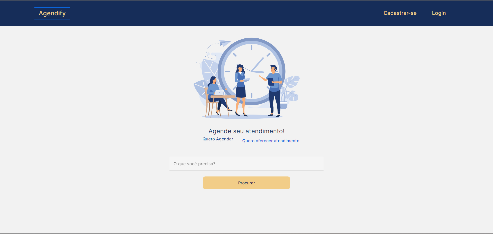

# Agendify

Agendify é uma plataforma de organização de agendamento de horários, que fornece um meio para que os estabelecimentos ou provedores de serviço divulguem seus horários disponíveis de atendimento individual, o cliente interessado poderá acessar a página deste provedor para agendar o horário para a realização do atendimento.

Este projeto destinou-se a uma entrega de _Trabalho de Conclusão de Curso_ para o curso _Pós Gradução em Engenharia de Software_ na PUC Minas.

Desenvolvido por [Marcos Martins](https://github.com/MarcosMart1ns) e [Vagner Sousa](https://github.com/VagnerFreitas).

[Relatório Técnico](./others/docs/).

[Vídeo de Apresentação](./others/docs/) da telas do sistema.

## Arquitetura

Utilizamos o Padrão Arquitetural MVC organizado em um Monolito Modular, onde a aplicação é dividida em módulos com responsabilidades e testáveis de forma independente, podendo ser facilmente atualizados ou substituídos sem afetar outros módulos, mas com repositório único e **com distribuição em um único pacote** mesmo usando tecnologias distintas no Backend e Frontend.

### Tecnologias utilizadas
 
- Backend
   - Java 17
   - Spring Boot
   - Spring Data
   - Spring Security
   - Spring MVC
- Frontend
  -	Angular 16
  -	TypeScript
  -	Bootstrap
  -	Angular Material                                                                                                                      
- Banco de Dados
  -	MySQL
- Infra
  - Azure
  - Azure Aplication Services
  - Docker